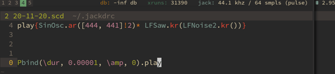

# jack_meter_simple



A simple script that displays amplitude in db of the output of a jack device as plain text. This is a fork/rework of Nicholas J. Humfrey's `jackmeter` but with a much more simplified output that works well with status bar programs like `i3blocks` and `i3status`.

## Example command
Run the command:
```bash
jack_meter_simple SuperCollider:out_1
```
Set several ports (which will be mixed to mono before analysis)
```bash
jack_meter_simple "PulseAudio JACK Sink:front-left" "PulseAudio JACK Sink:front-right"
```

## Example i3blocks config


```bash
[jack_db]
align=left
command=$HOME/code/c/jack_meter_simple/jack_meter_simple SuperCollider:out_1
interval=persist
label=<span color="#B57614">db: </span>
```

## Building

```bash
git clone https://github.com/madskjeldgaard/jack_meter_simple
cd jack_meter_simple
./autogen.sh && make
```

Credits
==========
This is a fork of Nicholas J. Humfrey's jack_meter. He did all the hard work, so thanks to him! 
For the latest version of Jack Meter, please see:
<https://www.aelius.com/njh/jackmeter/>

